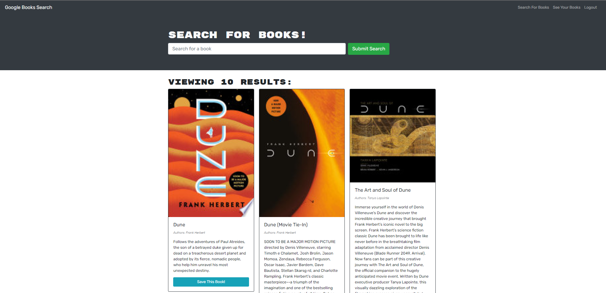

# Book-Lookup
# **Budget Tracker PWA**

### *Given a functioning book lookup app, students were asked to refactor the existing code from traditional API routes to GraphQL. This was accomplished by defining schema, mutations and queries and refactoring the app and server files to include Apollo. NOTE: there is a bug in the Auth that causes the getMe query to return undefined (11/23).* 

##  

## Mock Up
 

## Links
Github: https://github.com/parkersatterfield/Book-Lookup
Live: https://lookbookup.herokuapp.com/

## Table of Contents 

1. [Installation](#installation)

2. [Usage](#usage)

3. [Contributing](#contributing)

4. [Test](#test)

5. [Questions](#questions)

## Installation 

No install required.
## Usage 

Use this app to track you transactions.

## Contributing 

Georgia Tech Coding Boot Camp teaching staff built the infrastructure of this application, while students were asked to refactor it to use graphql.

## Test 

There are no tests in this app.

## Questions 

Email: parkers205@gmail.com 

GitHub: https://github.com/parkersatterfield 

---

## License Information 
APACHE 2.0 (Not really, I am just showing of my README generator app).

            